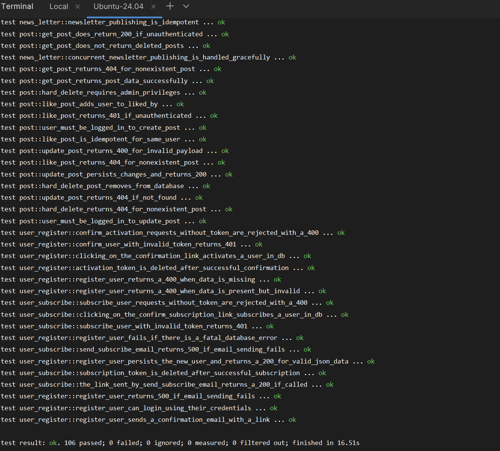
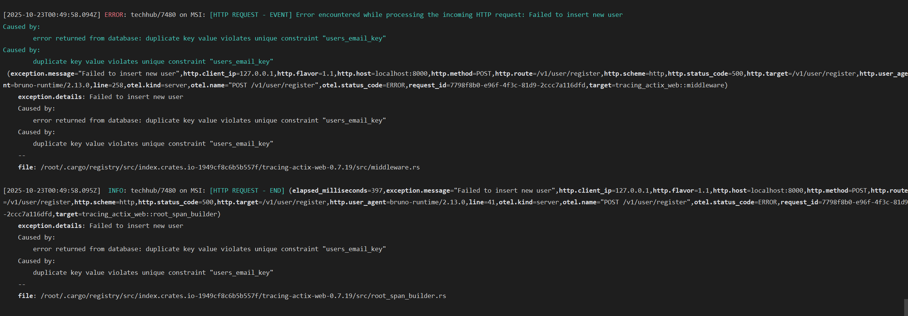

# TechHub

TechHub is a Rust-idiomatic, production-grade platform powered by Actix Web and PostgreSQL. Built with TDD
and comprehensive property-based unit tests, fuzzing, and end-to-end black-box integration tests.

Offers post creation with full-text search and pagination, comments, likes, and admin-driven newsletters to users
powered by background workers for async and idempotent email delivery.

Implements hexagonal architecture and domain modeling with compile-time validation via Rust’s type system.
Features a full authentication system including user registration, login, transactional email confirmation, secure
password reset, and token-based session authentication, built on concurrency and distributed-systems-safe transactions
under strict Postgres isolation guarantees.

Delivers full-fledged telemetry with tracing spans, performance metrics, and error handling at the right level of
abstraction. Deployed using multi-stage Docker builds on AWS ECS with RDS and ElastiCache (Redis) for
reliable, scalable operation.

## Core Technologies & Skills

* **Languages & Frameworks**: Rust, Actix Web, Bash
* **Database & Cache**: PostgreSQL, Redis
* **DevOps & Cloud**: Docker, Amazon Web Services (AWS)

## Architecture & Design

### **Hexagonal Architecture (Ports and Adapters)**

The application is structured around the **domain logic**, ensuring the core business rules are isolated and independent
of external concerns like databases or web frameworks.

* **Application Layer**: Handles I/O and orchestration (e.g., **HTTP Handlers**, **Background Workers**).

* **Domain Layer**: Contains the core business logic (e.g., **Entities**, **Value Objects**, **Business Rules**).

* **Infrastructure Layer**: Handles external dependencies (e.g., **Database**, **Email**, **Cache**).

### **Domain-Driven Design (DDD) Principles**

* **Compile-time validation** using **Rust's type system** ensures data integrity early.
* **Aggregate roots** enforce **consistency boundaries** for transactional operations.
* **Value objects** are used for explicit and reusable validation (e.g., for **email**, **username**, **password**).

---

## Quick Start

### Prerequisites

- Rust 1.90+
- Docker
- PostgreSQL
- Redis

### Run from Scratch

```bash
# Clone and setup
git clone <repository>
cd techhub

# Start all services (PostgreSQL, Redis, Migrations)
make run-scratch

# The API will be available at http://localhost:8000
```

### Run Test Suite

```bash
# Run all tests
make test

# Run tests with structured logging
make test-log

# Run specific test
make test-single name=test_name

# Run tests in release mode
make test-release
```

### Run Fuzzers

```bash
# Run all fuzzers
make fuzz

# Run specific fuzzer for 60 seconds
make fuzz-single name=fuzz_user_email duration=60

# Intensive fuzzing (300s per fuzzer)
make fuzz-intensive

# Generate coverage reports
make fuzz-coverage name=fuzz_user_email
```

---

### Tests



### Error Logs

